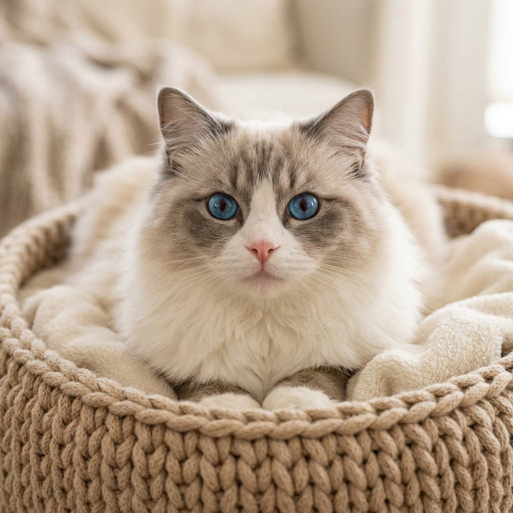

# 🐾 PetPlanet — 记录奶盖的成长与守护

一个纯前端宠物成长记录应用，专为马尔济斯小狗 **奶盖** 打造。  
奶油流体磨砂玻璃风格，手机模拟器 UI，支持 PWA 安装到手机桌面。

## ✨ 功能

- **🏠 首页** — 宠物名片、今日提醒、快速记录入口、最近动态
- **❤️ 健康** — 疫苗/体检时间轴、体重追踪曲线、医疗状态一览
- **🛒 生活** — 月度消耗统计、用品余量提醒、消费分类饼图
- **📸 回忆** — 拍立得风格照片墙、按月份筛选、点赞互动
- **📋 档案** — 宠物基础资料、健康简报、可编辑信息弹窗
- **🎀 互动** — 底部看板娘小猫，点击互动吐泡泡聊天
- **📱 PWA** — 可添加到手机主屏幕，独立窗口运行

## 🖼️ 预览



> 在浏览器中打开 `index.html` 即可查看完整效果。

## 🛠️ 技术栈

| 类别 | 技术 |
|------|------|
| 页面结构 | HTML5 单页应用 |
| 样式 | CSS3（流体渐变、磨砂玻璃、手账风格） |
| 逻辑 | 原生 JavaScript（无框架） |
| 图标 | [Lucide Icons](https://lucide.dev/) (CDN) |
| 图表 | 内联 SVG（折线图、柱状图、曲线图） |
| 开发服务器 | [Vite](https://vitejs.dev/) |
| PWA | Web App Manifest |

## 🚀 本地运行

```bash
# 克隆仓库
git clone https://github.com/zhe8013-bot/petapp.git
cd petapp

# 安装依赖
npm install

# 启动开发服务器
npm run dev
```

或者直接用浏览器打开 `index.html` 即可（无需服务器）。

## 📁 项目结构

```
petapp/
├── index.html          # 主页面（所有页面内容）
├── app.js              # 核心逻辑（状态管理、页面切换、图表渲染）
├── style.css           # 样式入口（@import 各模块 CSS）
├── manifest.json       # PWA 配置
├── package.json        # 项目配置
├── css/
│   ├── base.css        # 基础变量、全局样式
│   ├── emulator.css    # 手机模拟器外壳
│   ├── home.css        # 首页样式
│   ├── health.css      # 健康页样式
│   ├── life.css        # 生活页样式
│   ├── memories.css    # 回忆页样式
│   ├── profile.css     # 档案页样式
│   └── components.css  # 弹窗、按钮等通用组件
└── *.png               # 图片资源（宠物照片、3D 图标）
```

## 📝 自定义

编辑 `app.js` 中 `state.pet` 对象即可替换为你自己的宠物信息：

```js
state: {
  pet: {
    name: "你的宠物名",
    breed: "品种",
    age: "年龄",
    weight: 体重,
    birth: "出生日期",
    // ...
  }
}
```

## 📄 License

MIT
